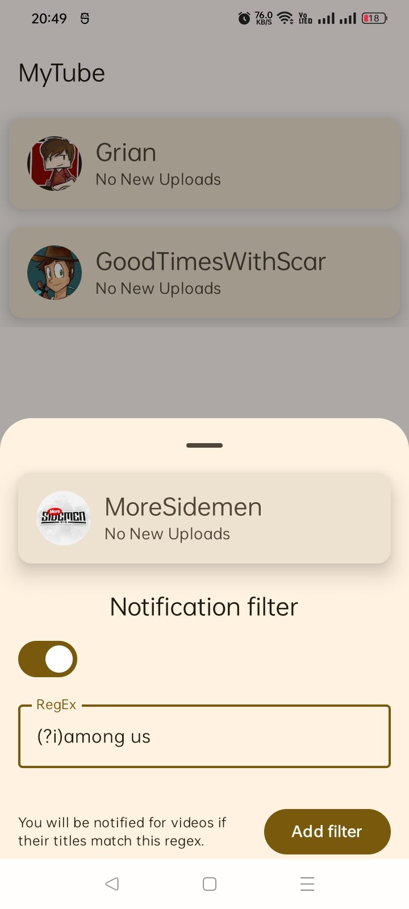
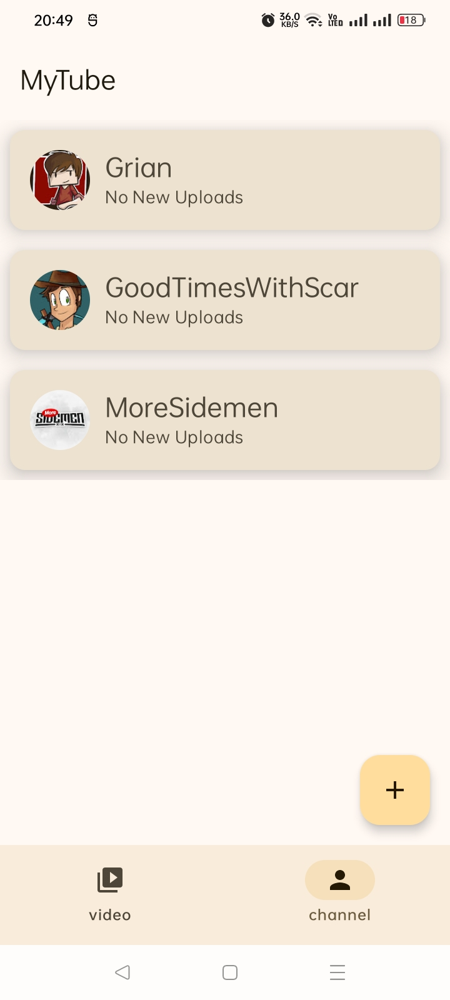
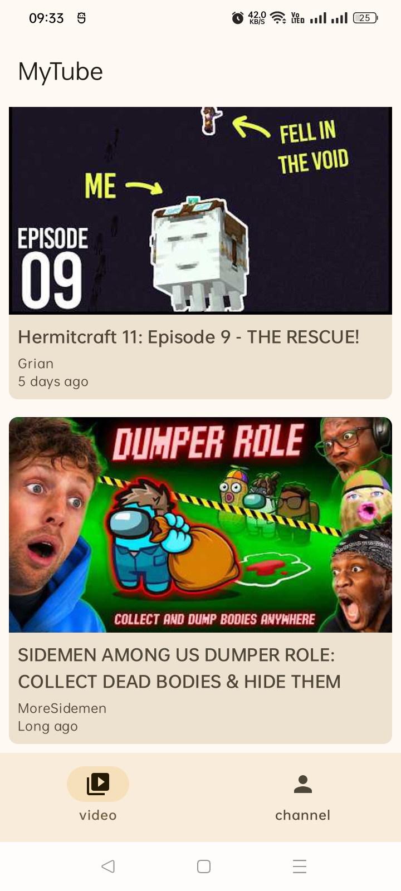
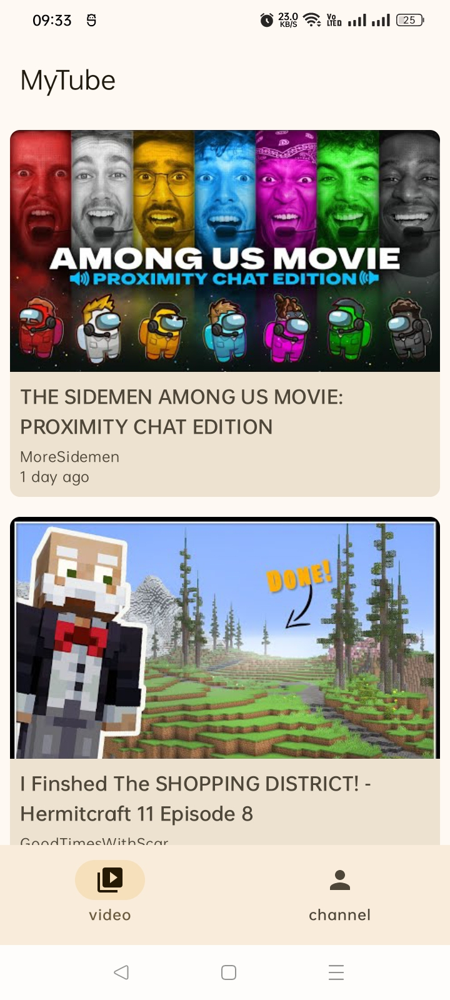

# My-Tube

**My-Tube** is an Android application that delivers targeted notifications for new YouTube uploads.
Instead of notifying users about every video from a channel, My-Tube allows fine-grained control using **regular expression–based title filters**, ensuring notifications are only sent for relevant content.

---

## Overview

Many YouTube channels publish a wide variety of content, but users are often interested in only specific types of videos. My-Tube addresses this by enabling users to subscribe to channels and define flexible notification rules based on video titles.

With My-Tube, users can:

* Subscribe to one or more YouTube channels
* Configure **regex filters** for each channel
* Receive notifications only when new uploads match (or do not match) the defined filters
* View filtered videos directly within the app

**Example use case:**
A user subscribes to the *MoreSidemen* channel and receives notifications only when a video title contains a specific keyword or pattern (e.g., “Among Us”), or alternatively when it does *not* contain that pattern.

---

## Features

* Selective notifications for new YouTube uploads
* Regular expression–based video title filtering
* Channel subscription and management
* Channel search powered by the YouTube Data API
* In-app video feed for matched uploads
* Periodic background synchronization

---

## Screenshots

<p align="center">
  
  &nbsp;&nbsp;
  
  &nbsp;&nbsp;
  
  &nbsp;&nbsp;
  
</p>

---

## How It Works

### Channel Discovery

* Users search for and add channels using the **YouTube Data API**
* Channel metadata is retrieved and stored locally

### Video Retrieval

* New uploads are fetched via the channel’s **YouTube RSS feed**
* This approach avoids excessive API usage and improves efficiency

### Filtering & Notifications

* Each channel can be associated with a regex filter
* Notification rules (user will select one of them):

  * Notify when the video title **matches** the regex
  * Notify when the video title **does not match** the regex
* Only videos that satisfy the configured rule trigger notifications

### Background Updates

* The app periodically parses RSS feeds
* Newly detected videos are evaluated against saved filters
* Notifications are issued only when all conditions are met

---

## Technical Details

* **Platform:** Android
* **Programming Language:** Kotlin / Java *(as applicable)*
* **APIs & Data Sources:**

  * YouTube Data API (channel search and metadata)
  * YouTube RSS Feeds (video updates)
* **Filtering:** Regular expressions (Kotlin/Java regex engine)
* **Background Processing:** Periodic background tasks (e.g., WorkManager)
* **Architecture:** MVVM / Clean Architecture *(if applicable)*

---

## Design Decisions

### Why Use RSS Feeds?

* Minimizes YouTube Data API quota consumption
* Enables lightweight and reliable polling for new uploads
* Reduces unnecessary network and data overhead

---

## Getting Started

### Prerequisites

* Google cloud 'Youtube data API'
* Android Studio (latest stable version recommended)
* Android SDK
* Android Emulator or physical Android device
* Minimum Android version: **Android 10 (API 29)**

### Installation

1. Clone the repository:

```bash
git clone https://github.com/AbrarShakhi/my-tube.git
```
2. Open the project in **Android Studio**
3. open `local.properties` paste your api key under your SDk path like this `YOUTUBE_API_KEY=******`
4. Allow Gradle to sync dependencies
5. Run the app on an emulator or connected device

---

## Testing

* Tested on Android emulator and physical devices
* Compatible with multiple screen sizes and resolutions

---

## Contributing

Contributions are welcome!
Feel free to fork this repository and submit a pull request with improvements, bug fixes, or new features.

---

## License

This project is licensed under the **Apache License 2.0**.
See the [LICENSE](LICENCE) file for details.

## Credits

<a href="https://www.flaticon.com/free-icons/paper" title="paper icons">Paper icons created by Pixel perfect - Flaticon</a>


